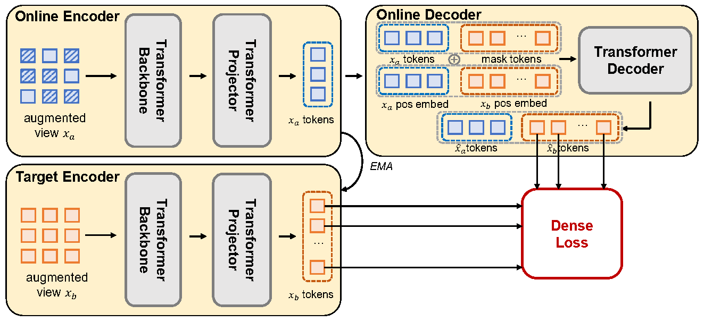
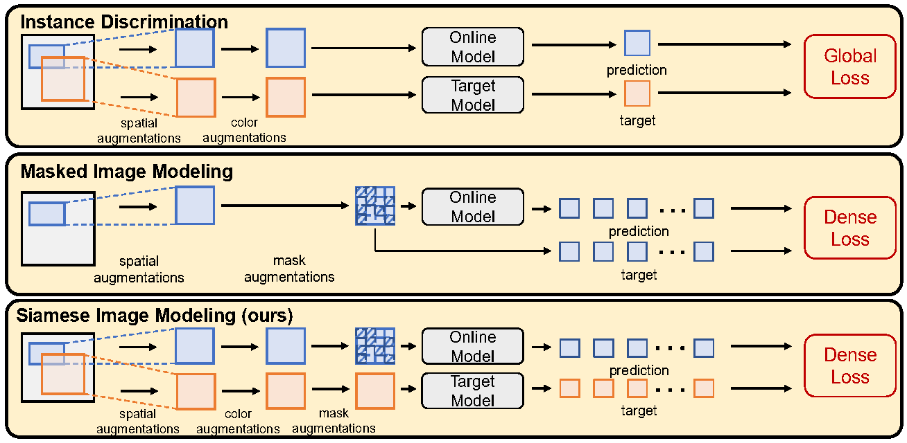

# Siamese-Image-Modeling

By [Chenxin Tao](https://scholar.google.com/citations?user=sXHFIBkAAAAJ&hl=zh-CN),
[Xizhou Zhu](https://scholar.google.com/citations?user=02RXI00AAAAJ),
[Weijie Su](https://www.weijiesu.com/),
[Gao Huang](http://www.gaohuang.net/),
[Bin Li](http://staff.ustc.edu.cn/~binli/),
[Jie Zhou](https://scholar.google.com/citations?user=6a79aPwAAAAJ&hl=en),
[Yu Qiao](https://scholar.google.com.hk/citations?user=gFtI-8QAAAAJ&hl=en),
[Xiaogang Wang](http://www.ee.cuhk.edu.hk/~xgwang/),
[Jifeng Dai](https://jifengdai.org/)

This is the official implementation of the CVPR 2023 paper [Siamese Image Modeling for Self-Supervised Vision Representation Learning](https://arxiv.org/pdf/2206.01204.pdf).



## 🏠 Introduction

SiameseIM is a new form of self-supervised learning that can learn semantic alignment and spatial sensitivity with a single dense loss. We note the following key observations from SiameseIM:

- Compared with MIM methods, SiameseIM shows that reconstructing another view helps to obtain good semantic alignment.

- Compared with ID methods, SiameseIM shows that dense supervision can be applied by matching the dense correspondence between two views strictly through their relative positions. 

- SiameseIM is able to surpass both MIM and ID methods over a wide range of tasks. SiameseIM obtains more improvements in few-shot, long-tail and robustness-concerned scenarios.





## 📈 Main Results

<table border="1" width="100%">
  <tr align="center">
    <th></th>
    <th colspan="3">ImageNet</th>
    <th colspan="2">COCO</th>
    <th>ADE20k</th>
    <th colspan="4">LVIS</th>
    <th colspan="4">Robustness</th>
  </tr>
  <tr align="center">
    <td></td><td>FT</td><td>LIN</td><td>1% FT</td><td>AP box</td><td>AP mask</td><td>mIoU</td><td>AP box</td><td>AP box rare</td><td>AP mask</td><td>AP mask rare</td><td>IN-A top-1</td><td>IN-R top-1</td><td>IN-Sketch top-1</td><td>IN-C 1-mCE</td>
  </tr>
  <tr align="center">
    <td>MoCo-v3 (ID method)</td><td>83.0</td><td>76.7</td><td>63.4</td><td>47.9</td><td>42.7</td><td>47.3</td><td>37.3</td><td>25.5</td><td>35.3</td><td>25.8</td><td>32.4</td><td>49.8</td><td>35.9</td><td>55.4</td>
  </tr>
  <tr align="center">
    <td>MAE (MIM method)</td><td>83.6</td><td>68.0</td><td>51.1</td><td>51.6</td><td>45.9</td><td>48.1</td><td>40.1</td><td>29.3</td><td>38.1</td><td>29.1</td><td>35.9</td><td>48.3</td><td>34.5</td><td>48.3</td>
  </tr>
  <tr align="center">
    <td><b>SiameseIM</b></td><td><b>84.1</b></td><td><b>78.0</b></td><td><b>65.1</b></td><td><b>52.1</b></td><td><b>46.2</b></td><td><b>51.1</b></td><td><b>40.5</b></td><td><b>30.9</b></td><td><b>38.1</b></td><td><b>30.1</b></td><td><b>43.8</b></td><td><b>52.5</b></td><td><b>38.3</b></td><td><b>57.1</b></td>
  </tr>
  <tr align="center">
    <td>Improve w.r.t. MoCo-v3</td><td>+1.1</td><td>+1.3</td><td>+1.7</td><td>+4.2</td><td>+3.5</td><td>+3.8</td><td>+3.2</td><td>+5.4</td><td>+2.8</td><td>+4.3</td><td>+11.4</td><td>+2.7</td><td>+2.4</td><td>+1.7</td>
  </tr>
  <tr align="center">
    <td>Improve w.r.t. MAE</td><td>+0.5</td><td>+10.0</td><td>+14.0</td><td>+0.5</td><td>+0.3</td><td>+3.0</td><td>+0.4</td><td>+1.6</td><td>+0.0</td><td>+1.0</td><td>+7.9</td><td>+4.2</td><td>+3.8</td><td>+8.8</td>
  </tr>
</table>


Note:

(1) Compared with MoCo-v3, SiameseIM improves dense prediction tasks (COCO detection, ADE20k segmentation, LVIS detection) significantly;

(2) Compared with MAE, SiameseIM improves long-tail, few-shot, robustness tasks (ImageNet linear evaluation & few-shot classification, ADE20k segmentation, LVIS detection) significantly;

(3) Notably, ADE20k segmentation and LVIS detection both contain long-tail classes, which put forward high requirement for semantic alignment, and detection tasks, which demand good spatial alignment. Thus, SiameseIM can surpass both MoCo-v3 and MAE by a large margin on these tasks.


## 🛠️ Usage
### Preparation

See [prepare.md](docs/prepare.md)

### Model Checkpoint

See [checkpoints.md](docs/checkpoints.md)

### Pretrain

See [pretrain.md](docs/pretrain.md)

### Finetune

See [finetune.md](docs/finetune.md)

### Linear Evaluation

See [linear_eval.md](docs/linear_eval.md)

### Few-shot Evaluation

See [few_shot.md](docs/few_shot.md)

### COCO & LVIS Detection

We use ViTDet for detection tasks, please refer to [detectron2](https://github.com/facebookresearch/detectron2/tree/main/projects/ViTDet).

### ADE20k Segmentation

We follow MAE to use UPerNet for segmentation task, please refer to [mmsegmentation](https://github.com/open-mmlab/mmsegmentation/tree/main/configs/mae).

### Robustness Evaluation

We evaluate the ImageNet finetuned model on [ImageNet-A](https://github.com/hendrycks/natural-adv-examples), [ImageNet-R](https://github.com/hendrycks/imagenet-r), [ImageNet-Sketch](https://github.com/HaohanWang/ImageNet-Sketch) and [ImageNet-C](https://github.com/hendrycks/robustness) datasets.


## 📃 License

This project is released under the [CC-BY-NC 4.0 license](./LICENSE).

## 🖊️ Citing SiameseIM
If you find SiameseIM useful in your research, please consider citing:
```bibtex
@inproceedings{tao2023siamese,
  title={Siamese image modeling for self-supervised vision representation learning},
  author={Tao, Chenxin and Zhu, Xizhou and Su, Weijie and Huang, Gao and Li, Bin and Zhou, Jie and Qiao, Yu and Wang, Xiaogang and Dai, Jifeng},
  booktitle={Proceedings of the IEEE/CVF Conference on Computer Vision and Pattern Recognition},
  pages={2132--2141},
  year={2023}
}
```